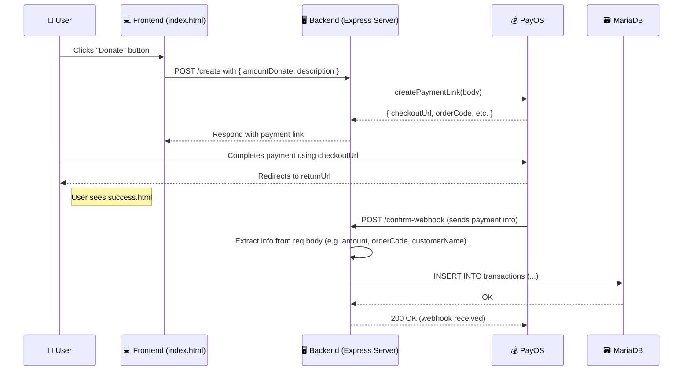

# Tham Quan Ảo Đền Hùng – WebDev Adventure 2025 

Dự án được phát triển bởi nhóm **Chích Chòe**, tham gia cuộc thi **WebDev Adventure 2025** do CLB WebDev Studios – Trường ĐH CNTT, ĐHQG TP.HCM tổ chức.
## 📛 Giới thiệu

Lễ hội **Giỗ Tổ Hùng Vương** là một trong những dịp trọng đại của dân tộc Việt Nam. Tuy nhiên, rào cản về khoảng cách địa lý, thiếu trải nghiệm tương tác và hạn chế trong việc bảo tồn di sản khiến nhiều người không thể tiếp cận trọn vẹn giá trị văn hóa này.

**Dự án Tham Quan Đền Hùng** ra đời nhằm tái hiện lễ hội thông qua nền tảng web 3D ứng dụng công nghệ thực tế ảo và tương tác số, hướng đến việc bảo tồn, lan tỏa và kết nối cộng đồng với giá trị truyền thống Việt.
## 🎯 Đối tượng người dùng

- Giới trẻ Việt Nam và kiều bào nước ngoài
- Du khách quốc tế yêu thích văn hóa Việt
- Các nhà giáo dục, tổ chức văn hóa
- Cộng đồng yêu công nghệ và bảo tồn di sản

## 📸 Link thiết kế Figma
[Figma thiết kế giao diện website](https://www.figma.com/design/XpG29Qk2bjWnKQF9PQqoTT/D%E1%BB%B1-%C3%A1n-%22Ng%C3%A0y-Gi%E1%BB%97-T%E1%BB%95%22?node-id=0-1&p=f)

## 🛠️ Công nghệ sử dụng

- **Frontend:** HTML, CSS, JavaS, React
- **3D Engine:** Three.js / Unity WebGL
- **Thanh toán & Donate:** PayOS
- **Database:** MariaDB và GUI adminer để quản lí database được tích hợp trong docker

## 📌 Tính năng chính

- **Trang Chủ** – Giới thiệu về các Vua Hùng, lịch sử Giỗ Tổ, kiến trúc di tích.
- **Hoạt Động** – Tái hiện trò chơi dân gian, nghi lễ truyền thống bằng video tương tác.
- **Không Gian Cộng Đồng** – Người dùng đăng bài, ảnh, video trải nghiệm.
- **Tham Quan 3D** – Khám phá không gian lễ hội và Đền Hùng với công nghệ WebXR.

### 💳 Tính năng: hệ thống donate 
Với mục tiêu trùng tu các công trình lưu giữ văn hóa nghìn năm, cùng với đó là mong muốn hệ thống minh bạch, an toàn giúp dùng an tâm tuyệt đối khi chuyển tiền vào quỹ hỗ trợ. Nhóm sử dụng hệ thống toán điện tử PayOS vì không cần phải đăng kí kinh doanh như các công nghệ dịch vụ khác (Momo, ZaloPay)

#### 🧩 Quy trình hệ thống donate (workflow)



## .env / Biến môi trường
```env
CLIENT_ID = 
API_KEY = 
CHECKSUM_KEY = 
DB_HOST = db
DB_PORT = 3306
DB_USER = myuser
DB_PASSWORD = mypass
DB_DATABASE = mydb
DB_CONNECTION_LIMIT= 10

MINIO_END_POINT = minio
MINIO_PORT = 9000
MINIO_USE_SSL = false
MINIO_ACCESS_KEY = minioadmin
MINIO_SECRET_KEY = minioadmin
MINIO_BUCKET_NAME = webdev2025
```

## ⚙️ Cách chạy dự án

Donwload file về và giải nén file hoặc sử dụng ``` git clone ```.
### Đối với FE
Sử dụng câu lệnh ```cd fe ``` trong terminal và chạy câu lệnh ```npm run dev```
### Đối với BE
Sử dụng câu lệnh ```cd fe ``` trong terminal 
Sử dụng phần mềm Docker để có thể chạy các chương trình được đóng gói trong container bằng câu lệnh ```docker compose up --build```
## 📘 API Documentation
### 🖼️ MinIO's API Calls `api/minio/` 

| **API Endpoint**                           | **HTTP Method** | **Description**                                               | **Request Parameters**                       | **Request Body**                             | **Response**                                                                 | **Example**                          |
|--------------------------------------------|-----------------|---------------------------------------------------------------|---------------------------------------------|----------------------------------------------|-----------------------------------------------------------------------------|--------------------------------------|
| `/files`                                   | `GET`           | Lists files in a specific folder in MinIO.                     | `path` (query parameter: path to the folder) | None                                         | JSON array containing file names.                                           | `GET /files?path=images` -> `["image1.jpg", "image2.png"]` |
| `/preview`                                 | `GET`           | Streams a preview of a file from MinIO.                        | `path` (query parameter: file path)         | None                                         | Streams the file content.                                                   | `GET /preview?path=images/image1.jpg` -> File streamed in response |
| `/file`                                    | `GET`           | Downloads a file from MinIO.                                   | `path` (query parameter: file path)         | None                                         | Downloads the file as an attachment with `Content-Disposition`.             | `GET /file?path=images/image1.jpg` -> File downloaded |
| `/files/:path`                             | `POST`          | Uploads a file to a specified folder in MinIO.                 | `path` (URL parameter: `images`, `videos`, `posts`) | `multipart/form-data` with `file` field | Success message if file is uploaded successfully.                          | `POST /files/images` -> File uploaded |

---
### 🔗 Donate's API Calls: `/api/donate`

| Method | Endpoint                    | Description                                           | Request Params / Body                                                                                              | Response                                                                 |
|--------|-----------------------------|-------------------------------------------------------|---------------------------------------------------------------------------------------------------------------------|--------------------------------------------------------------------------|
| POST   | `/create`                   | Tạo link thanh toán PayOS và chuyển hướng người dùng | **Body:** `{ description, amountDonate, userId }`                                                                  | `redirect` đến `checkoutUrl` nếu thành công, JSON lỗi nếu thất bại      |
| GET    | `/find`                     | Tìm donate theo userId hoặc tên                      | **Query:** `userId?`, `userName?` (ít nhất 1)                                                                      | `{ error, message, data: [donation records] }`                           |
| GET    | `/topDonaters`             | Lấy top 10 người donate nhiều nhất                   | –                                                                                                                   | `{ error, message, data: [ { id_user, total_donated } ] }`              |
| GET    | `/:userId`                  | Lấy tổng tiền donate của một người dùng              | **Path param:** `userId`                                                                                           | `{ error, message, data: { id_user, total_donated } }`                  |
| POST   | `/confirm-webhook`          | Nhận thông tin thanh toán từ PayOS                   | **Body:** `{ data: { orderCode, amount, description, transactionDateTime } }`                                      | `{ error, message }` (ghi vào DB nếu thành công)                        |


## 🚀 Định hướng tương lai

- Mở rộng nội dung lịch sử – giáo dục
- Tối ưu hóa hiển thị 3D cho thiết bị yếu
- Triển khai hệ thống donate hợp pháp theo quy định
- Phát triển thêm khu vực **Đền Hùng Phú Thọ** bên cạnh Đền tưởng niệm ở TP.HCM

## 📋 Phân công nhóm

| Thành viên              | Vai trò                    |
|-------------------------|----------------------------|
| Lưu Vĩnh Hưng           | Ý tưởng dự án              |
| Lương Triển Đạt         | Tổng quan dự án            |
| Võ Minh Quân            | Nội dung tổng quan & ý tưởng |
| Đoàn Nguyễn Minh Thư    | Thiết kế poster & nội dung |
| Đặng Gia Nguyên         | Thiết kế poster            |

---

> 💡 Dự án không vì mục đích lợi nhuận, hướng đến kết nối cộng đồng và bảo tồn giá trị văn hóa dân tộc thông qua công nghệ hiện đại.
